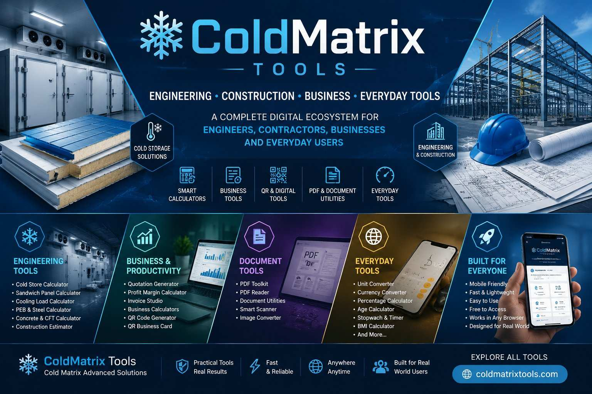

<h1>❄️ ColdMatrix Tools</h1>

<h2>Cold Matrix Advanced Solutions</h2>

<strong>Engineering • Construction • Business • Productivity • Everyday Digital Tools</strong>

A growing ecosystem of practical, free and mobile-friendly browser tools built from real-world experience.

<a href="https://coldmatrixtools.com/">
<strong>🌐 Explore ColdMatrix Tools</strong>
</a>

---

# ❄️ Welcome to ColdMatrix Tools

**ColdMatrix Tools** is a practical digital ecosystem created to bring real-world engineering knowledge, construction experience, business requirements and everyday utilities together in one accessible platform.

The platform is designed for:

**Engineers • Contractors • Builders • Business Owners • Technicians • Students • Professionals • Everyday Users**

The philosophy is simple:

> **Turn real-world knowledge into simple digital tools that people can use anywhere.**

ColdMatrix combines technical calculators with business utilities, document tools, QR tools, productivity applications and everyday digital utilities — all designed to work directly in the browser.

---

# 🚀 One Ecosystem. Multiple Worlds.

ColdMatrix is organized around four major areas:

| 🏭 ENGINEERING | 💼 BUSINESS | 🛠️ PRODUCTIVITY | 🌐 EVERYDAY |
|:---:|:---:|:---:|:---:|
| Cold Storage | Quotations | PDF Tools | Currency |
| Sandwich Panels | Profit | QR Tools | Percentage |
| PEB | Invoices | Scanners | Units |
| Steel | Business Tools | Image Tools | Time |
| Construction | Calculations | Digital Studios | Date & More |

---

# 🏭 Engineering & Construction Tools

The engineering side of ColdMatrix is inspired by practical work in:

**Cold Storage • Refrigeration • PU/PIR Insulated Panels • XPS Insulation • Prefab Construction • PEB Structures • Steel • Concrete • Construction Estimation**

### 🧊 Cold Store Calculator

A practical calculator for cold-room dimensions, area, volume and related cold-storage calculations.

### 🧱 Sandwich Panel Calculator

Designed for estimating sandwich-panel requirements based on dimensions and panel coverage.

### ❄️ Cooling Requirement Calculator

A practical tool for estimating cooling requirements based on room conditions and application.

### ⚙️ Steel Weight Calculator

Calculate approximate steel weight for common structural steel sections and dimensions.

### 🏗️ PEB Material Calculator

Useful for preliminary estimation and planning of pre-engineered building materials.

### 🧱 Concrete Calculator

Calculate concrete quantities for common construction applications.

### 🏢 Construction Cost Calculator

A practical tool for preliminary construction cost estimation.

### 📐 CFT Calculator

Quick cubic-feet calculations for construction and general measurement requirements.

---

# 💼 Business & Commercial Tools

ColdMatrix also provides tools designed around everyday business requirements.

### 📄 Quotation Generator

Create professional quotations quickly without complicated software.

### 💰 Profit Margin Calculator

Calculate selling price, cost, profit and margin for business decisions.

### 🧮 Business Calculator Suite

A collection of practical business-oriented calculations in one place.

### 🧾 Invoice Studio

Tools for creating practical business invoices and managing common invoicing requirements.

### 📱 QR Business Card

Create a digital business-card experience using QR technology.

### 🔳 QR Code Generator

Generate QR codes directly in the browser for practical business and personal use.

---

# 📑 PDF & Document Tools

ColdMatrix includes browser-based document utilities designed for quick everyday use.

### 📚 PDF Toolkit

A collection of useful PDF-related functions.

### 📖 PDF Reader

A lightweight browser-based PDF reading utility.

### 📝 Document & Business Utilities

Additional tools and studios are being developed around practical document and business workflows.

---

# 🛠️ Smart Productivity Tools

ColdMatrix is also expanding into modern digital productivity.

### 📷 Smart Scanner

A browser-based scanning utility designed for quick document and image capture workflows.

### 🖼️ Image Converter

Convert images between common formats directly in the browser.

### 🔐 Password Generator

Generate strong random passwords for safer digital use.

### 📶 Internet Speed Test

Quickly test internet connection performance.

---

# 🌐 Everyday Digital Tools

ColdMatrix isn't limited to engineering.

The platform also provides simple tools for everyday digital requirements.

### 💱 Currency Converter

Quick currency conversion for everyday calculations.

### 📊 Percentage Calculator

Fast percentage calculations for business, education and daily use.

### 📏 Unit Converter

Convert between commonly used measurement units.

### 🎂 Age Calculator

Calculate age based on date of birth.

### 🎉 Birthday Countdown

Calculate the time remaining until a birthday or selected date.

### ⏱️ Stopwatch & Timer

Simple browser-based timing utilities.

### ❤️ BMI Calculator

A simple body-mass-index calculation utility.

---

# 🧩 Digital Studios

ColdMatrix is also developing specialized digital workspaces rather than relying only on individual calculators.

### 🧾 Cold Invoice Studio

A dedicated business-oriented invoice environment.

### 🎨 Cold Matrix Studio

A broader digital workspace for practical business and design-oriented functions.

These studios form part of the long-term ColdMatrix ecosystem.

---

# 🧠 The ColdMatrix Philosophy

ColdMatrix wasn't created simply to collect calculators.

The concept comes from a practical question:

> **Why should useful technical knowledge require expensive software or complicated systems?**

Many calculations used by engineers, contractors, businesses and everyday users can be simplified into fast browser-based tools.

ColdMatrix aims to make those tools:

- ✅ Simple
- ✅ Practical
- ✅ Fast
- ✅ Mobile-friendly
- ✅ Accessible
- ✅ Easy to understand
- ✅ Useful in real-world situations

---

# 🏗️ From Field Experience to Digital Tools

ColdMatrix's foundation is connected to practical experience in industrial and construction-related work.

The ecosystem reflects knowledge across:

**Cold Storage**

↓  

**PU/PIR Insulated Panels**

↓  

**XPS & Insulation**

↓  

**Prefab Buildings**

↓  

**PEB Structures**

↓  

**Refrigeration**

↓  

**Industrial Installation**

↓  

**Construction Estimation**

↓  

**Business Management**

↓  

**Digital Productivity**

This connection between physical-world experience and digital tools is what gives ColdMatrix its identity.

---

# 📱 Designed for Mobile Use

Modern tools should work where people actually use them.

ColdMatrix tools are designed with mobile users in mind.

Whether you're:

- 📱 Standing at a project site
- 🏗️ Checking quantities during construction
- 🧮 Calculating material requirements
- 💼 Preparing a quotation
- 📄 Working with a document
- 🔳 Creating a QR code
- 🌐 Checking a conversion
- 🏠 Working from home

the objective is to provide quick access without requiring complicated desktop software.

---

# ⚡ Browser-Based & Accessible

ColdMatrix follows a lightweight browser-first approach.

### No complicated installation

Most tools work directly from a modern web browser.

### No unnecessary registration

The platform is designed around accessibility rather than forcing users through complicated account systems.

### Mobile-friendly

The interface is designed to work comfortably on phones and larger screens.

### Practical

The emphasis is on useful results rather than unnecessary complexity.

---

# 🔧 Technology Approach

ColdMatrix is built around modern web technologies and lightweight browser functionality.

The ecosystem uses technologies such as:

- HTML
- CSS
- JavaScript
- Responsive design
- Browser-based calculations
- Client-side utilities
- Progressive web capabilities
- QR and image technologies
- Lightweight digital tools

The objective is to keep tools fast, accessible and easy to maintain.

---

# 🌍 Built for a Global Audience

Although the platform is strongly influenced by practical engineering and construction requirements, ColdMatrix is designed for users worldwide.

Its potential audience includes:

**Engineers**

**Contractors**

**Builders**

**Architects**

**Technicians**

**Business Owners**

**Students**

**Freelancers**

**Professionals**

**Everyday Users**

---

# 📈 A Growing Ecosystem

ColdMatrix Tools is an evolving platform.

New calculators, utilities and digital tools can be added as practical needs are identified.

The long-term vision is to build a broad ecosystem where users can find:

### Engineering Tools
Calculators for construction, cold storage, insulation, steel and structural requirements.

### Business Tools
Quotations, invoices, profit calculations and business utilities.

### Productivity Tools
PDF, QR, image, scanning and document utilities.

### Everyday Tools
Conversion, time, date, finance and general-purpose calculators.

---

# 🧮 Engineering Knowledge + Digital Simplicity

One of the main goals of ColdMatrix is to bridge the gap between technical knowledge and everyday usability.

A professional engineer may understand a complex calculation.

A contractor may need the answer quickly on a mobile phone.

A business owner may only need the final figure.

A student may need to understand the calculation.

ColdMatrix aims to serve all of them through **simple, practical interfaces**.

---

# 🏆 What Makes ColdMatrix Different?

| Feature | ColdMatrix Approach |
|:---|:---|
| 🧠 Practical Knowledge | Inspired by real-world applications |
| 🧮 Calculations | Focused on useful results |
| 📱 Mobile | Designed for phone-first access |
| ⚡ Speed | Lightweight browser-based tools |
| 🔓 Accessibility | Free and easy to access |
| 🛠️ Variety | Engineering + business + everyday tools |
| 🌍 Reach | Designed for users worldwide |
| 🚀 Growth | Continuously expanding ecosystem |

---

# 🔗 Explore the Platform

### 🌐 Main Website

<a href="https://coldmatrixtools.com/">
<strong>https://coldmatrixtools.com/</strong>
</a>

  

### 🏭 Engineering

Cold Storage • Sandwich Panels • PEB • Steel • Concrete • Construction

### 💼 Business

Quotations • Profit • Invoices • QR • Business Tools

### 📑 Productivity

PDF • Documents • Scanning • Images • Digital Studios

### 🌐 Everyday

Currency • Percentage • Units • Age • Birthday • Timer • Utilities

---

# 🛠️ Project Direction

ColdMatrix is being developed as more than a collection of isolated web pages.

The goal is to create a connected ecosystem of tools where every new utility contributes to a larger practical platform.

Future development can include:

- 🤖 AI-assisted tools
- 🧠 Smart engineering assistance
- 📊 Advanced calculators
- 🏗️ More construction tools
- ❄️ Advanced cold-storage utilities
- 💼 More business automation
- 📄 More document tools
- 🔐 More privacy-focused utilities
- 📱 Progressive web functionality

---

# 🌟 The Bigger Vision

The vision behind ColdMatrix is straightforward:

> **Make useful knowledge and useful tools easier to access.**

Technology should simplify practical work.

Engineering should not always require complicated software.

Business calculations should not require expensive systems.

Everyday utilities should not require downloading a separate application for every small task.

ColdMatrix brings these ideas together in one growing digital ecosystem.

---

# ❤️ Why ColdMatrix Exists

Every tool begins with a simple question:

**Can this task be made easier?**

If the answer is yes, ColdMatrix aims to turn that idea into a practical browser tool.

From calculating a cold-storage requirement to preparing a quotation, converting a unit, generating a QR code or checking a percentage — the purpose remains the same:

**Make the task simpler.**

---

# ❄️ ColdMatrix Tools

### **Engineering Knowledge. Business Utility. Everyday Convenience.**

### **One Growing Digital Ecosystem.**

 

<a href="https://coldmatrixtools.com/">
<strong>🌐 Explore ColdMatrix Tools</strong>
</a>

  

**Built from real-world experience.**

**Designed to solve real-world problems.**

 

❄️ **ColdMatrix Tools**

